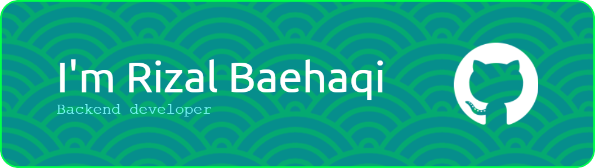

# Halo👋 

 Selamat datang di profil GitHub saya! Saya adalah mahasiswa di **Universitas Ivet Semarang**, dengan minat besar dalam dunia **pengembangan web** dan **pemrograman**.  

## 🧑‍💻 Tentang Saya 

- 🎓 Mahasiswa Universitas Ivet Semarang. 
- 💻 Berpengalaman dalam pengembangan web dan backend. 
- 🚀 Suka membangun proyek open-source dan terus belajar teknologi baru.  

## 🔧 Teknologi yang Saya Kuasai 

- 🖥️ **Bahasa Pemrograman**: HTML, CSS, JavaScript, Node.js, PHP. 
- ⚙️ **Framework**: React, Express, Laravel. 
- 🗄️ **Database**: MySQL, MongoDB. 
   Terima kasih sudah mampir ke profil saya! Jangan ragu untuk melihat repositori saya atau menghubungi saya untuk berkolaborasi dalam proyek teknologi. 🚀

## 🌐 Socials:

  

# 💻 Tech Stack:

                              

# 📊 GitHub Stats:

 
 

### ✍️ Random Dev Quote

### 🔝 Top Contributed Repo

---

<!-- Proudly created with GPRM ( https://gprm.itsvg.in ) -->
